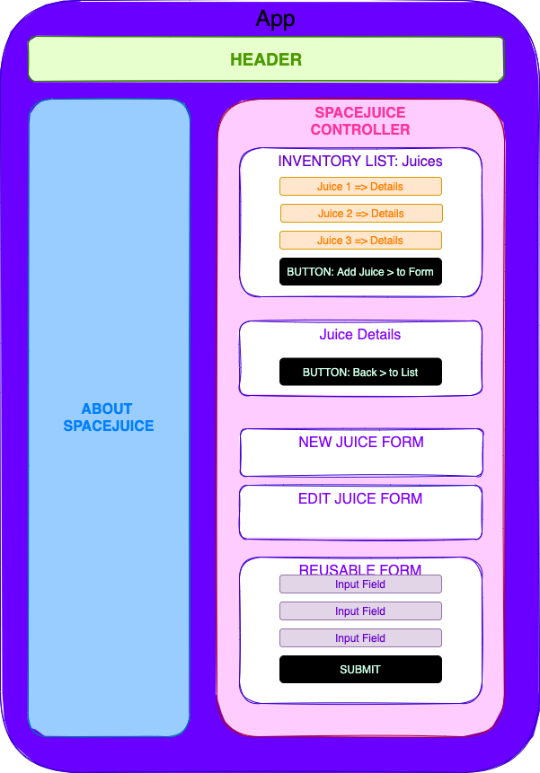

# _spaceJuice Inventory Tracker_

#### _React wk 2 – React Fundamentals Friday Project for Epicodus Bootcamp_

#### Created By: **Ella Tanttu**

## Technologies Used

- _HTML_
- _CSS_
- _Javascript_
- _React_
- _npm_
- _PropTypes_
- _UUID_

## Description

_TBD_

## Project Layout Diagram

## Setup/Installation Requirements

- _React version 3.2.0_

### Basic Setup

- Clone the GitHub repository: [https://github.com/ellajtanttu/spacejuice-tracker](https://github.com/ellajtanttu/spacejuice-tracker)
- From the main project directory, run `npm install` in the terminal to load necessary plugins and packages.
- Run `npm install --save-exact react-scripts@3.2.0` to install React version 3.2.0
- Run `npm run start` to start the application.

## Known Bugs

_None at this time_

## License

_[MIT](https://opensource.org/licenses/MIT)_
Copyright (c) _Ella Tanttu_

## Support and Contact Details

_[ellajtanttu@gmail.com](mailto:ellajtanttu@gmail.com)_

-------

# Planning and Brainstorming:

### Project Prompt:

SpaceJuice Retailer - tracking multiple drums (each a different flavor of spaceJuice), each drum holds 123 canisters.

- [ ] CREATE functionality
- [ ] READ functionality
- [ ] Item list page: a list/menu of all available kegs.
- [ ] Item detail page: 
    - [ ] Name
    - [ ] Brand
    - [ ] Price
    - [ ] Flavor(?)
- [ ] New Item form
- [ ] Click on item to see corresponding detail page
- [ ] Property:  how many remaining canisters are left: there are 123 canisters/drum
- [ ] Button on List and Detail page: sold a Canister, decreases total. Total canister count can’t go below 0

TO DO:
- [ ] pass in props
- [ ] conditional rendering
- [ ] implement Create form
- [ ] quantity property
- [ ] Button for quantity change